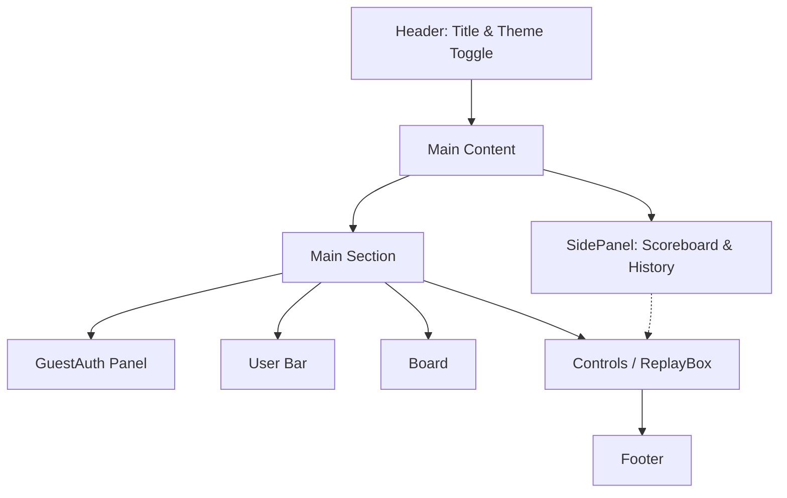
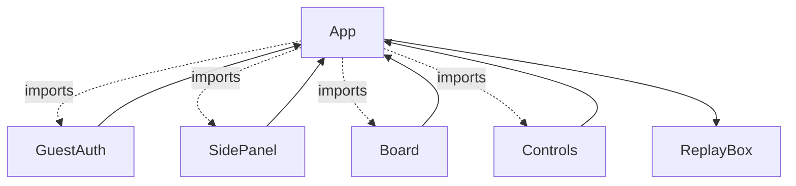

# Architecture Overview — Snake & Ladder React Frontend

This document provides a comprehensive overview of the frontend architecture for the Snake and Ladder web application, built using React.

---

## 1. Application Layout

The application employs a responsive **single-page layout**, structured as follows:

- **Header**: Displays the game’s title and theme toggler (Light/Dark).
- **Main Content**:
  - **Side Panel (Left/Top)**: Shows the scoreboard, recent game history, and navigation for replaying games.
  - **Main Section (Center/Primary Area)**:
    - **User Authentication Panel** (login as Guest, visible if not logged in).
    - **Game Area**:
      - **User Bar**: Greets logged-in user, offers logout.
      - **Game Board**: Visualizes the Snake and Ladder board, pawns, snakes, and ladders.
      - **Controls**: Implements dice rolling, next-turn actions, replay options, and disables/enables actions per state.
      - **Replay Box**: Controls and progresses through move-by-move replay of past games.
- **Footer**: Branding and minimal information.

---

## 2. Major Components & Responsibilities

### **App**
- _Role_: Main application component and hub for layout, all state management, logic, and conditional rendering.
- _State_: Handles theme, authentication, game engine state, move history, game history, scoreboard/stats, replay logic, and rolling dice.
- _Logic_: Drives game turn loop (player/AI), handles user authentication (as guest), manages session storage for persistence, orchestrates UI updates.

### **GuestAuth**
- _Role_: Minimal authentication for entering a username to play as a guest.
- _Input_: onLogin callback.
- _State_: Local input for the username field.

### **Board**
- _Role_: Renders 10x10 Snake and Ladder board.
- _Props_: Player position, AI position, highlight for last move, finished state, winner.
- _Functionality_: Zigzag cell layout, visual marks for snakes, ladders, and pawns.

### **Controls**
- _Role_: UI controls for rolling dice/play and replay interactions.
- _Props_: Player turn, action callbacks, game state, dice result, rolling state.

### **SidePanel**
- _Role_: Shows current and historical scores, full game history, links for viewing game replays.
- _Props_: Game/history/statistics data.

---

## 3. Core Logic Overview

- **Authentication**: Guest only; no password or persistent backend. Username stored in local state for session.
- **Game State**: Managed with React useState for:
  - Player & AI pawn positions
  - Whose turn
  - Game started/finished flag
  - Dice result
  - Per-move and per-game histories
  - Winner info
  - Persistent scoreboard and aggregate stats (browser sessionStorage)
- **Game Engine**: 
  - Turns alternate between player and AI.
  - Moves use a simulated dice roll (`rollDice()`), move calculation, and snake/ladder transition map.
  - When a pawn reaches 100, triggers endgame/winner summary.
  - After each move, state updates and histories are stored.
- **Replay**:
  - SidePanel history entries can be selected for replay.
  - ReplayBox provides step-by-step navigation through moves for selected finished games, with visual board updates.
- **Theme**: Toggles global app theme CSS variables and HTML data attribute.

---

## 4. State Management

All state is local to the `App` component (hooks). Game state is reset and reinitialized on authentication or replay. Session data is persisted via browser `sessionStorage` for history and stats.

---

## 5. Feature Breakdown

- **Auth**: Guest login with display name entry.
- **Game Board UI**: 10x10 visualization with snakes, ladders, and pawns; animated last-move highlight.
- **Gameplay**: Dice-rolling, pawn movement, snakes/ladders logic, AI opponent (random).
- **Scoreboard & History**: Stats tracking, win counts, up-to-10 stored recent games.
- **Replay**: Navigate through any past game’s move sequence.
- **Theme**: Light/Dark toggling.
- **Responsive Design**: Uses CSS Flexbox & media queries, resizes on small screens, mobile-friendly.

---

## 6. Component Relationships

- **App** is the top-level controller, rendering children and passing state/data/callbacks as props.
- **Board**, **Controls**, **SidePanel**, **GuestAuth** are pure function components reliant solely on props (except for GuestAuth’s internal state).

---

## 7. Styling & Customization

- **Colors and variables** defined in `App.css`, themed via `:root` and `[data-theme='dark']` selectors.
- Layout (`main-layout`, `main-content`, `board`, etc.) is achieved via CSS modules and utility classes.
- All style is built with vanilla CSS (no external UI frameworks), prioritizing performance and maintainability.

---

## 8. Extensibility

- Additional authentication systems, multiplayer, networked play, or richer AI could be integrated by replacing corresponding App state/logic.
- Backend APIs may synchronize game state if desired, currently frontend-only.

---

## 9. File Structure (Key Files)

- **src/App.js** – Main application, logic, and presentation.
- **src/App.css** – Styles/theme/color palette.
- **src/index.js** – React bootstrapping.
- **src/index.css** – Global baseline styles.

---

## 10. Summary

The Snake & Ladder frontend is a highly maintainable, minimal, and modern React application relying on function components, hooks, and prop-driven design. All core logic sits within the single App component, making state and game behavior clear, traceable, and extensible.

